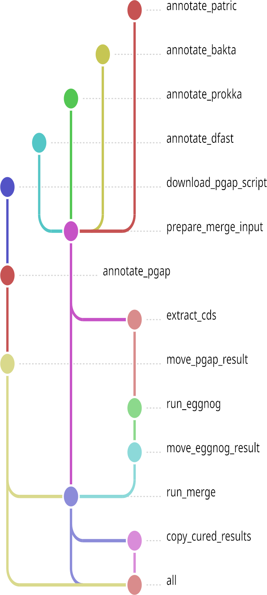

# SnakeMergeAnnotation

<p align="center">
  
  
  
  
</p>

> **Dockerized Snakemake pipeline for hypothetical protein curation in prokaryotic genomes.**

SnakeMergeAnnotation orchestrates five annotation tools (Bakta, Prokka, DFAST, PGAP, and BV-BRC/PATRIC) plus eggNOG in a single Snakemake workflow, then merges their results to transfer functional annotations to hypothetical proteins. It works for both **genomic** (isolate genomes with known taxonomy) and **metagenomic** (MAGs/bins with unknown taxonomy) data.

---

## New to bioinformatics or the command line? Start here

You only need three steps:

1. Install [Docker](https://docs.docker.com/get-docker/)
2. Install Snakemake: `pip install snakemake`
3. Run:
   ```
   python app.py
   ```
   then open `http://localhost:5000` in your browser.

The interface will walk you through the configuration, tools, merge, and execution tabs, with real-time progress tracking through the logs. You can also turn individual annotation tools on or off directly in the interface — no command-line flags needed.

Full step-by-step guide with screenshots: **[docs/quick-start-guide.md](docs/quick-start-guide.md)**

---

## Advanced mode (command line)

If you're already familiar with Snakemake, Docker, and editing `.yaml` files, you can jump straight to manual execution via `config.yaml` and the command line — including genomic vs. metagenomic run examples and HPC/cloud execution.

Full guide: **[docs/advanced-guide.md](docs/advanced-guide.md)**

---

## How it works (overview)

The pipeline is fully customizable: you can disable any annotation module you don't need (either via the graphical interface or with command-line flags). If you want to run every module, you'll need to complete all setup steps, including creating a username and password on the BV-BRC/PATRIC platform.

<p align="center">
  
  &nbsp;&nbsp;&nbsp;
  
</p>

1. **Annotation** — each genome is annotated independently by Bakta, Prokka, DFAST, PGAP, eggNOG, and BV-BRC (PATRIC). PATRIC submissions are handled in batch via the cloud API.
2. **Comparison** — an all-vs-all BLASTp comparison is performed between the predicted proteins (CDS) from every tool for each genome, using the result from the user-defined base tool as the local reference.
3. **Merge** — functional annotations from Bakta, Prokka, eggNOG, PGAP, and DFAST are transferred to entries labeled as "hypothetical protein" in the base annotation, using strict full-length alignment criteria (alignment length must equal CDS length) plus a user-defined minimum identity percentage.
4. **Defense systems** — defense-related annotations from DFAST are also transferred via perfect 1:1 matches.
5. **Final enrichment** — the consolidated annotation is enhanced with: gene symbols, EC numbers, GO terms, KEGG Orthology (KO), KEGG pathways, KEGG reactions, KEGG rclass, BRITE hierarchies, and PFAM domains.
6. **Reports** — per-genome Excel reports, hypothetical-protein reduction plots, and an article-ready summary table are generated automatically.

### Genomic vs. metagenomic data

SnakeMergeAnnotation can be used for both **genomic** and **metagenomic** data:

- For genomic data (isolate genomes with known taxonomy), all tools can be enabled, typically using PATRIC as the base tool.
- For metagenomic data (MAGs/bins), PATRIC and PGAP are **disabled by default**, since both require taxonomy information you may not have. If you do know the taxonomy of your MAG, you can enable them manually.
  - In **Bakta**, set `Genus`, `Strain`, and `Gram` to `unknown`.
  - In **Prokka**, set `Genus` to `unknown`.
  - In **DFAST**, set `organism` to `unknown`.

See **[docs/advanced-guide.md](docs/advanced-guide.md#genomic-vs-metagenomic-usage-examples)** for full command examples of both modes.

---

## Requirements

You only need to install two things on your machine — everything else runs inside Docker containers:

| Dependency | Version | Install |
|---|---|---|
| **Docker** | ≥ 20.10 | <https://docs.docker.com/get-docker/> |
| **Snakemake** | ≥ 9.0 | `pip install snakemake` |

A free account at [bv-brc.org](https://www.bv-brc.org) is also required for the PATRIC annotation step.

We recommend creating an isolated Python environment before installing Snakemake:
```
python -m venv venv
source venv/bin/activate
pip install snakemake
```

---

## Repository structure

```
snakemergeannotation/
├── app.py                  # Graphical interface (basic mode)
├── Snakefile                # Pipeline definition (advanced mode)
├── pgap.py                  # PGAP database downloader/updater
├── config.yaml              # Essential configuration
├── config_advanced.yaml     # Technical parameters (optional)
├── docs/                     # Guides and documentation
│   ├── quick-start-guide.md
│   ├── advanced-guide.md
│   ├── troubleshooting.md
│   └── glossary.md
├── examples/                 # Sample configuration and data
├── screen/                    # Screenshots used in the documentation
├── templates/                 # Web interface templates
└── LICENSE
```

---

## Output results

At the end of the run, the most important files are automatically highlighted in `output_dir/README.txt`. The main ones are:

| File | Description |
|---|---|
| `*_finalversion.gb` | Final enriched GenBank file — main result |
| `annotation_comparison_report.xlsx` | BLASTp comparison across all tools |
| `hp_summary_report.tsv` | Hypothetical protein counts at each merge step |
| `article_ready_table.csv` | Summary table ready for publication |
| `*_hp_reduction.png` | Hypothetical protein reduction curve per genome |

Full output folder structure: see **[docs/advanced-guide.md](docs/advanced-guide.md#output-structure)**.

---

## Running into problems?

Check **[docs/troubleshooting.md](docs/troubleshooting.md)** before opening an issue — most common errors (incorrect paths, missing databases, insufficient memory) are already documented there.

---

## Technical terms

If you come across unfamiliar terms or acronyms (CDS, BLASTp, frameshift, MAG, etc.), check the **[glossary](docs/glossary.md)**.

---

## Citation

If you use SnakeMergeAnnotation in your research, please also cite the underlying tools:

- **PGAP:** Tatiana et al. (2016) *Nucleic Acids Research*. <https://doi.org/10.1093/nar/gkw569>
- **Bakta:** Schwengers et al. (2021) *Microbial Genomics*. <https://doi.org/10.1099/mgen.0.000685>
- **Prokka:** Seemann (2014) *Bioinformatics*. <https://doi.org/10.1093/bioinformatics/btu153>
- **DFAST:** Tanizawa et al. (2018) *Bioinformatics*. <https://doi.org/10.1093/bioinformatics/btx713>
- **BV-BRC:** Olson et al. (2023) *Nucleic Acids Research*. <https://doi.org/10.1093/nar/gkac1003>
- **Snakemake:** Mölder et al. (2021) *F1000Research*. <https://doi.org/10.12688/f1000research.29032.2>

---

## License

AGPL-3.0 — see [LICENSE](LICENSE) for details.
