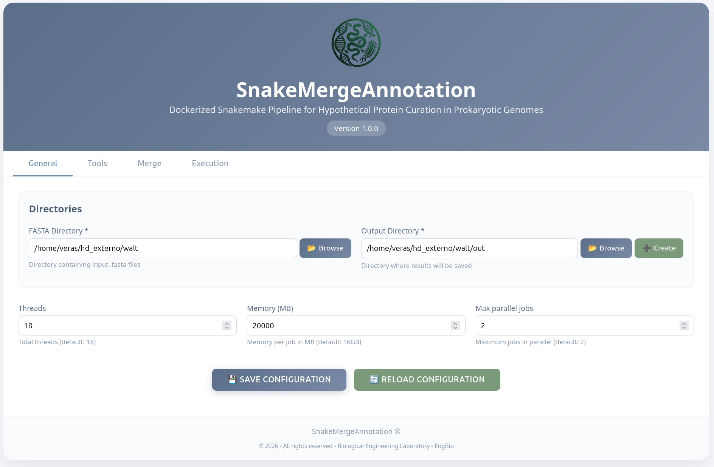

# Quick Start Guide — Basic Mode (Graphical Interface)

This guide is for anyone **with no command-line experience** who wants to use SnakeMergeAnnotation through the graphical interface.

## What you'll need

- A computer with Docker installed ([how to install](https://docs.docker.com/get-docker/))
- Python installed, with Snakemake (`pip install snakemake`)
- Your genome files in `.fasta`, `.fa`, or `.fna` format
- A free account at [bv-brc.org](https://www.bv-brc.org) — only needed if you plan to use the PATRIC tool

No programming knowledge or terminal use is required beyond the installation step below.

---

## Step 1 — Install the prerequisites

Open a terminal (Command Prompt on Windows; Terminal on Mac/Linux) and run:

```
pip install snakemake
```

Also make sure Docker is installed and running (you'll see the Docker "whale" icon active in your taskbar/menu bar).

## Step 2 — Download the databases

The annotation tools need reference databases. This only needs to be done once, and you only need to download databases for the tools you actually plan to use.

**Bakta database** (light version, ~3.9 GB, recommended):
```
docker run --rm \
    -v "/path/to/databases/bakta_db:/db" \
    engbio/bakta:v1 \
    bakta_db --output /db download --type light
```

**DFAST database** (~15 GB total):
```
docker run --rm \
    -v "/path/to/databases/dfast_db:/dfast_core/db" \
    engbio/dfast:v1 \
    python /dfast_core/scripts/file_downloader.py --protein dfast

docker run --rm \
    -v "/path/to/databases/dfast_db:/dfast_core/db" \
    engbio/dfast:v1 \
    python /dfast_core/scripts/file_downloader.py --cdd Cog

docker run --rm \
    -v "/path/to/databases/dfast_db:/dfast_core/db" \
    engbio/dfast:v1 \
    python /dfast_core/scripts/file_downloader.py --hmm TIGR
```

**PGAP database:** from the software's root directory, run:
```
python pgap.py --update
```
This downloads the PGAP database directly to your operating system user account.

> Tip: write down the full path where you saved these databases — you'll need it in Step 4. If you're working with metagenomic data (see [below](#genomic-data-vs-metagenomic-data)), you may not need PATRIC or PGAP at all, and can skip those downloads.

## Step 3 — Open the interface

From the terminal, inside the project folder, run:

```
python app.py
```

Open your browser (Chrome, Firefox, etc.) and go to:

```
http://localhost:5000
```

The main window looks like this:

<p align="center">

</p>

## Step 4 — Fill in the tabs

The interface has four main tabs:

1. **Home** — set the folder containing your genome files and the folder where results will be saved.

2. **Tools** — configure each annotation tool (Bakta, Prokka, DFAST, PGAP, PATRIC) according to the type of organism being analyzed. This is where you enter the full path to the databases you downloaded in Step 2. For PATRIC, enter your bv-brc.org username and password. **You can turn any tool on or off here** — simply disable the ones you don't want to run.

   <p align="center">
   
   </p>

3. **Merge** — set the criteria for how similar two proteins need to be to be considered "the same" across different tools, and which products are candidates for automatic curation. If you're not sure, leave the default values.

   <p align="center">
   
   </p>

4. **Run** — click run and follow progress in real time through the Logs panel.

   <p align="center">
   
   </p>

## Genomic data vs. metagenomic data

SnakeMergeAnnotation works with two kinds of input:

- **Genomic data** — an isolate genome where you know the taxonomy (genus, species). In this case, you can enable all tools, including PATRIC.
- **Metagenomic data** — a MAG (metagenome-assembled genome) or bin where the taxonomy is unknown. In this case:
  - Disable **PATRIC** and **PGAP** in the Tools tab (both require taxonomy information).
  - In **Bakta**, set `Genus`, `Strain`, and `Gram` to `unknown`.
  - In **Prokka**, set `Genus` to `unknown`.
  - In **DFAST**, set `organism` to `unknown`.
  - If you *do* know the taxonomy of your MAG, you can enable PATRIC/PGAP and fill in the fields normally.

## What to do once it's finished

When the run completes, open the output folder you specified on the Home tab. You'll find a `README.txt` (or `summary.html`) file pointing directly to:

- The main result (final enriched annotation)
- The publication-ready table
- The hypothetical protein reduction plots

## Running into problems?

If something goes wrong, check the **[troubleshooting guide](troubleshooting.md)**.
