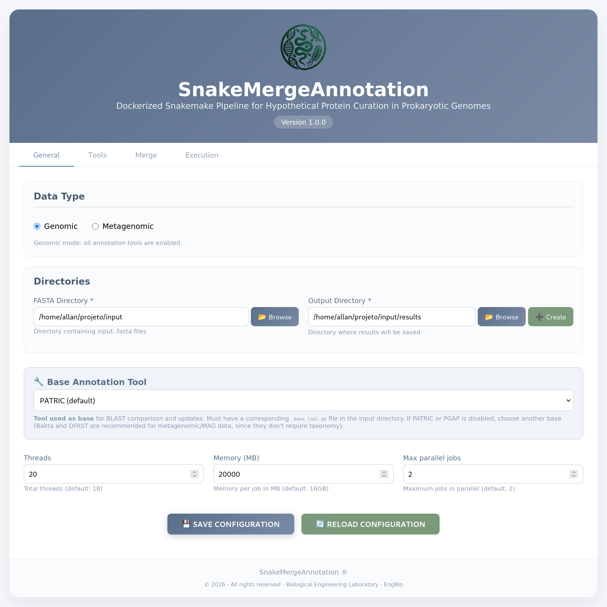
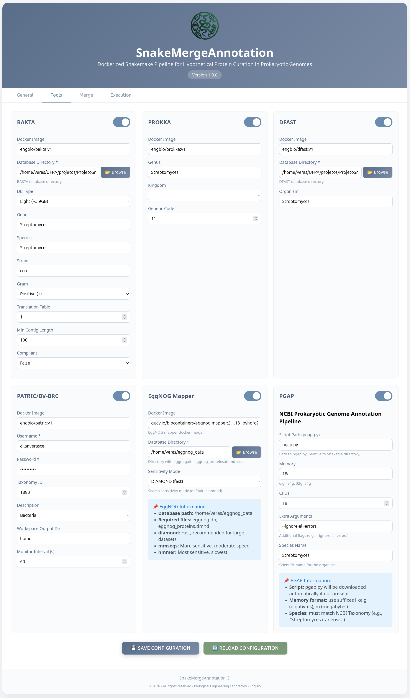
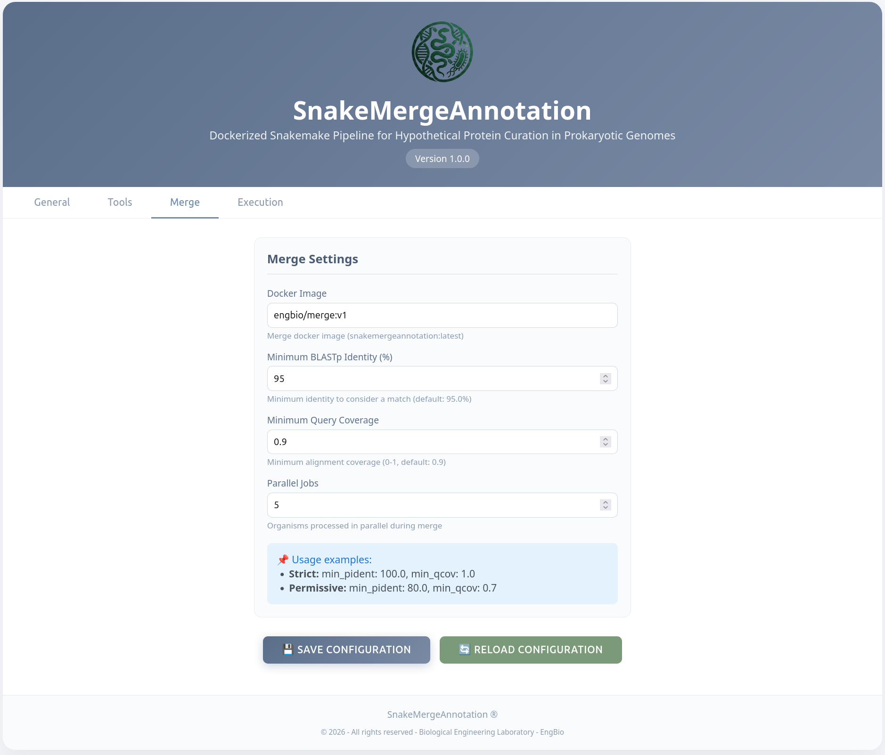
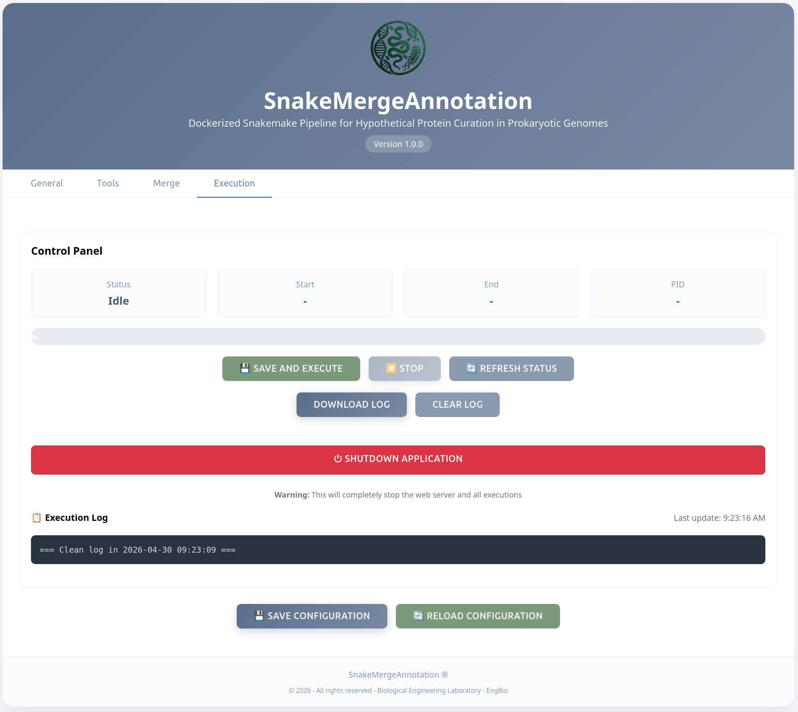

# Quick Start Guide — Basic Mode (Graphical Interface)

This guide is for anyone **with no command-line experience** who wants to use SnakeMergeAnnotation through the graphical interface.
The user can choose to use the dependency installation script: [install_dependencies.sh](https://github.com/allanverasce/snakemergeannotation/blob/main/install_dependencies.sh)

**Note:** After installing the components, proceed to Step 4 — Open the interface

## If you choose to follow the step-by-step guide, please follow the instructions below.  What you'll need

- A computer with Docker installed ([how to install](https://docs.docker.com/get-docker/))
- Python installed, with Snakemake (`pip install snakemake`)
- Your genome files in `.fasta`, `.fa`, or `.fna` format
- A free account at [bv-brc.org](https://www.bv-brc.org) — only needed if you plan to use the PATRIC tool

No programming knowledge or terminal use is required beyond the installation steps below.

---

## Step 1 — Get the project files

Open a terminal (Command Prompt on Windows; Terminal on Mac/Linux) and run:

```bash
git clone https://github.com/allanverasce/snakemergeannotation.git
cd SnakeMergeAnnotation
```

## Step 2 — Install the prerequisites

In the same terminal, run:

```
pip install snakemake
```

Also make sure Docker is installed and running (you'll see the Docker "whale" icon active in your taskbar/menu bar).

## Step 3 — Download the databases

The annotation tools need reference databases. This only needs to be done once, and you only need to download databases for the tools you actually plan to use.

**Bakta database** (light version, ~3.9 GB, recommended for most use cases; a full ~84 GB version is also available):
```bash
docker run --rm \
    -v "/path/to/databases/bakta_db:/db" \
    engbio/bakta:v1 \
    bakta_db --output /db download --type light
```

**DFAST database** (~15 GB total — protein reference, COG/CDD, and TIGRFAMs HMM databases):
```bash
# Protein reference database
docker run --rm \
    -v "/path/to/databases/dfast_db:/dfast_core/db" \
    engbio/dfast:v1 \
    python /dfast_core/scripts/file_downloader.py --protein dfast

# COG/CDD database
docker run --rm \
    -v "/path/to/databases/dfast_db:/dfast_core/db" \
    engbio/dfast:v1 \
    python /dfast_core/scripts/file_downloader.py --cdd Cog

# TIGRFAMs HMM database
docker run --rm \
    -v "/path/to/databases/dfast_db:/dfast_core/db" \
    engbio/dfast:v1 \
    python /dfast_core/scripts/file_downloader.py --hmm TIGR
```

**PGAP database:** from the software's root directory, run the following command to download the PGAP database directly to your operating system user account:
```bash
python pgap.py --update
```

Database space requeriments
4.0G	databases/db-light


## Step 4 — Open the interface

To start basic mode, from the terminal, inside the project folder, run:

```
python app.py
```

To open the main window of the SnakeMergeAnnotation interface, open your preferred internet browser and enter the URL `http://localhost:5000` into the address bar.

The main window will be displayed as shown in the figure below.

<p align="center">

</p>

**Figure from the SnakeMergeAnnotation main window**

## Step 5 — Fill in the tabs

The interface has four main tabs:

**1. Home** — set the folder containing your genome files and the folder where results will be saved.

**2. Tools** — the following image is from the second tab, called *Tools*, where the user can configure each annotation tool according to the type of organism being analyzed. It is important to enter the full path of the previously downloaded databases and, in the specific case of the PATRIC tool, the user must register to obtain the platform username and password. **You can also turn any tool on or off here** — simply disable the ones you don't want to run.

<p align="center">

</p>

**3. Merge** — in the Merge tab, the user can configure the parameters to consider which products are candidates for automatic curation.

<p align="center">

</p>

**4. Run** — in the execution tab, the user can run their analysis and monitor processing in real time through the Logs area.

<p align="center">

</p>

## Genomic data vs. metagenomic data

SnakeMergeAnnotation can be used for **genomic** or **metagenomic** data.

- **Genomic data** — an isolate genome where you know the taxonomy (genus, species). In this case, you can enable all tools, including PATRIC and PGAP.
- **Metagenomic data** — a MAG (metagenome-assembled genome) or bin where the taxonomy is unknown. For metagenomic data specifically, the **PATRIC** and **PGAP** tools are disabled by default, since both require the user to specify the taxonomy. If the user already has this information, the tools can be enabled as desired.
  - In **Bakta**, the fields `Genus`, `Strain`, and `Gram` must be set to `"unknown"`.
  - In **Prokka**, `Genus` must be set to `"unknown"`.
  - In **DFAST**, `organism` must also be set to `"unknown"`.

## What to do once it's finished

When the run completes, open the output folder you specified on the Home tab. You'll find a `README.txt` (or `summary.html`) file pointing directly to:

- The main result (final enriched annotation: *_cured.gb)
- The publication-ready table
- The hypothetical protein reduction plots

## Running into problems?

If something goes wrong, check the **[troubleshooting guide](troubleshooting.md)**.
